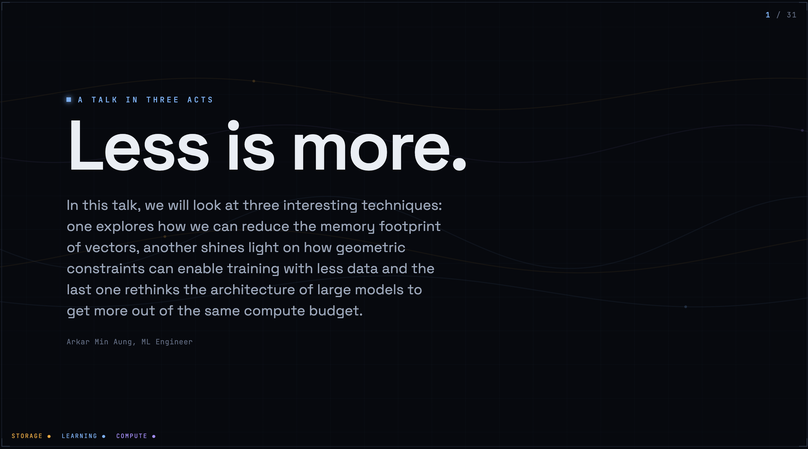

# Less is More · Efficient LLMs

This presentation explores how to maximize efficiency in Large Language Models (LLMs) by addressing three key dimensions of waste: **Memory**, **Data**, and **Architecture**.

### Core Themes:
- **Memory (KV Cache):** Exploring how vector rotation can enable highly efficient, data-free quantization of the KV cache (e.g., TurboQuant).
- **Data (Training):** Using geometric constraints to reduce the amount of data required for effective training.
- **Architecture (Depth):** Rethinking model structure to get more performance out of the same compute budget.

[Explore the interactive talk here](https://arkaung.github.io/less-is-more-talk/)
